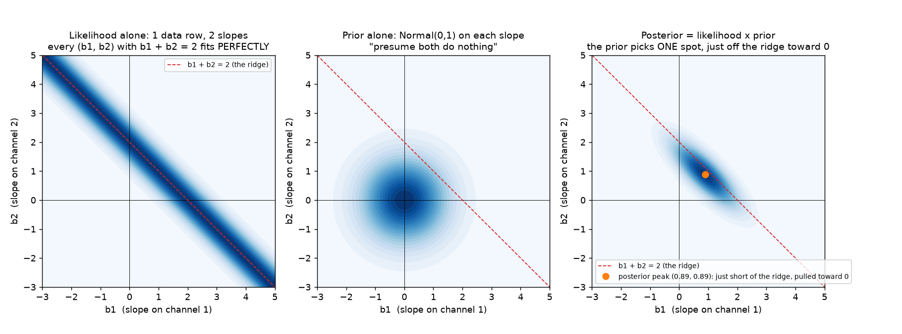
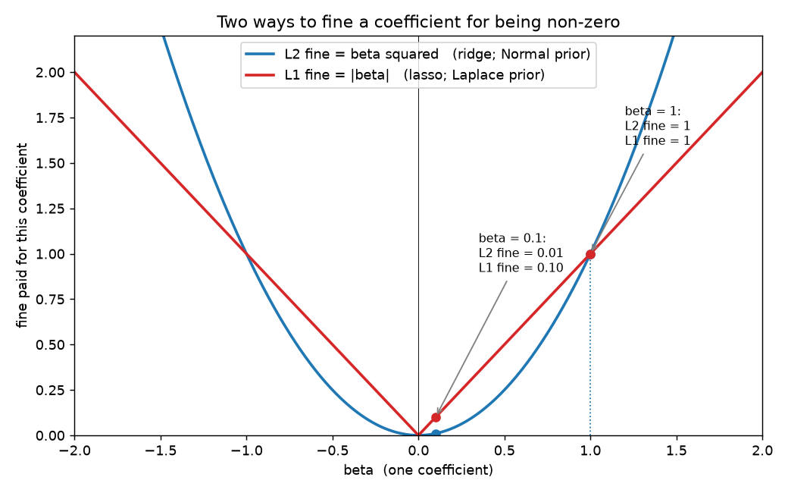

# A prior that looked harmless

One full session from my Bayesian statistics course, the second half of a lesson on priors as regularization. MMM means marketing mix model, a regression that attributes sales to advertising channels. It has dozens of parameters, each with a prior.

Everything below is what appeared in my terminal, in order, minus the tool calls. My messages are the quoted blocks, as typed, most of them dictated. Figures were drawn by the tutor mid-session and pushed to my phone; they are re-rendered here from its code. One figure was sent twice during the session (the first version had an eyeballed peak), only the corrected one is shown.

Edits: colleagues and clients quoted by name are now "a colleague", one line about time elapsed was dropped, and the git housekeeping at the very end was cut.

---

Notebook loaded. Reading the 3.2 materials, then I'll open the session.

Welcome back. A normal warm-up, then the second half of 3.2. Rule 4 applies today: 3.2 gets this session and then we close it out, whatever is left goes into warm-up rotation.

**Where we are, in three lines**

- Last time: ridge is a fine on coefficient size. A zero-centered Normal prior on a slope is that same fine, just with units on it.
- Then you drove a foundations detour: SSE, sigma is a number not a distribution, and how the normal density gets built. Good stuff, all of it.
- Today: the war stories. Priors that look weak but are secretly aggressive, more parameters than data points, and what "dropping a variable" really is.

**Warm-up 1 of 2.** This is the pick-probe I wrote last session and never got to ask.

Setup, self-contained: a regression where every predictor has been standardized (mean 0, standard deviation 1). The outcome is also standardized. So every slope reads as "how many SDs of y per one SD of that channel".

Four candidate priors for a slope:

```
A.  beta ~ Normal(0, 0.1)
B.  beta ~ Normal(0, 1)
C.  beta ~ Normal(0, 10)
D.  beta ~ Normal(2, 1)
```

Second number is the standard deviation in every case.

Two questions, answer both in a line or two each:

1. Which of A, B, C is the **most regularized** (the stiffest spring, the biggest fine)?
2. D is the odd one out. What **kind** of claim is D making that A, B, C are not?

> **Me**
>
> 1. A is the most regularized? Very narrow
> 2. Center is in 2?


**1. Right.** A. Standard deviation 0.1 on a standardized slope says "this channel almost certainly moves y by less than 0.3 SD". That's a strong fine. C at sd 10 is barely a fine at all.

**2. Half.** You described D correctly, the center is 2. But the question was what kind of claim that is. One nudge:

A, B, C all say "presume innocence". The effect is zero until the data drags it off zero. Only the *strength* of the presumption differs.

D says something different in kind, not degree. Before seeing a single row of data, what does D already believe about this channel?

> **Me**
>
> It believes that the mean happens at 2 unless the data says otherwise


Yes. And that's the whole point: D is **not a regularizer**. A regularizer pulls toward "no effect". D pulls toward "a big positive effect of 2 SD per SD". That's an assertion about the world, made before any data.

Which is fine, if you can defend it. It's the beta(1,3) vs beta(3,2) argument from earlier in the course in a different skin: an informative prior is a claim, and claims need reasons. The trap is writing D and *thinking* you wrote B.

House phrase for this: **a zero-centered prior is skeptical. An off-center prior is an opinion.**

**Warm-up 2 of 2.** Fresh skin, from the density detour last time.

A model predicts daily sales for a shop. On one day it was **40 units off**.

A colleague asks: "is that a lot?"

What do you say back? One line.

> **Me**
>
> 40 standard deviations off? or just 40 sales unit off or something arbitrary


Right instinct, you refused to answer without the units. Take it as raw: 40 sales, on a shop that sells a few hundred a day.

What's the **one number** you need from the model before you can answer your colleague?

> **Me**
>
> The mean and the standard deviation? I say standard deviation out of my ass but idk if thats a representative number


Not out of your ass. That's exactly the number, and the hedge is the only gap. Let me close it.

"40 off" already **is** the miss. It's y minus mu, the actual sales minus what the model expected. So the mean has already been used up. You don't need it again.

What you need is **sigma**: the model's own claim about how far off a typical day lands. Then:

```
z = 40 / sigma
```

In words: the miss, measured in units of the story's own scatter.

- sigma = 40: z = 1. A normal day. About a third of days miss by this much or more.
- sigma = 10: z = 4. Something happened. The model's story has no room for this.

So the honest answer to your colleague is: "depends on the sigma the model fit. What was it?" Same sentence you gave, just with the hedge removed. Sigma is not arbitrary. It's a fitted parameter, sitting in the trace next to the slopes.

Both warm-ups pass. Saving a checkpoint, then the lesson.


Figure sent to Telegram. Look at it while you read this.

**The secretly aggressive prior.** This is a real war story. An engineer set priors on a set of effects. The number in the code was small, something like sigma = 0.01. Everyone read it as "small number, gentle prior, harmless". Weeks later someone actually checked what the prior *implied for the data*, and found the prior put almost all its weight on a change of 1 to 2 percent. The model had been told, before seeing data, that these effects basically don't exist. Nobody meant that.

**Why it happens.** The prior sits on a parameter, call it theta. But theta is not sales. Sales is downstream of theta through some transform: an exponent, a softmax, a saturation curve. The prior's *strength* is not the number you typed. It's how much room the prior leaves **where the effect lands**.

**Reading the figure.**

- Left panel: theta, the number in the code. HalfNormal with sigma 0.01. It looks like nothing.
- Right panel: the same draws, pushed through exp and turned into "percent change in sales". Red is that prior. All of it lands in the first bar. 95 percent of draws say "under 2 percent change".
- Blue is a HalfNormal with sigma 0.5. Same shape of prior, fifty times wider. It lets the effect be anything from 0 to a 166 percent lift.

Same code shape. One is "I have no idea how big this is". The other is "this does nothing". The number 0.01 told you neither.

**The fix is a tool you already own from Unit 2:** the prior predictive check. Draw from the priors, push through the whole model, look at the fake data it generates. Measure strength there, in data space, never by squinting at the sigma.

House phrase: **strength lives in data space.**

One-line recap: small sigma is not weak, small sigma is *strong*, and the transform can make it stronger than you think.

**Probe, fresh skin.** A colleague writes `HalfNormal(0.01)` on an effect that feeds through a softmax. They say: "tiny sigma, so it's a weak prior, we're fine."

Two things: is "tiny sigma = weak prior" even right on its own, before the softmax? And what's the one thing you'd do before agreeing with them?

> **Me**
>
> I'm a bit confused. You're saying that this prior on the left means that we're saying to the model that sales change is very small, like less than 10%. The extreme is already 10%. You're saying that it's not a weak prior. It's just a wrong prior, right? Tiny sigma doesn't mean weak prior. It means we assume that this won't have that big of an effect, which itself is a strong statement. But I am confused about, or is that just the point of this, what you just said that half norm, like small and big priors, are both strong assumptions? Also separately, just a tangent that you don't have to take too seriously: I'm wondering if these things just get glossed over because there are so many parameters and so many priors to keep track of?


Not wrong prior, and you've actually got it. Let me restate the core in three sentences, because your second paragraph is correct and the confusion is only in the words "weak" and "strong".

1. **Strong prior = narrow. Weak prior = wide.** That's the only meaning. A strong prior leaves little room, a weak one leaves lots.
2. **Small sigma is a strong prior.** Always. Sigma is the width. The trap is purely psychological: 0.01 *looks* like a small, modest, harmless number, so people read it as "weak". It's the opposite.
3. **Both are assumptions, but not both are strong.** Blue (sigma 0.5) assumes "could be anything up to a big lift". Red (sigma 0.01) assumes "this does nothing". Only red is a strong claim.

So your sentence, "tiny sigma means we assume this won't have a big effect, which is itself a strong statement", is exactly the lesson. "Wrong" is a fair word too: it was strong *and* nobody intended it. That combination is the war story.

One small precision on the figure: red's 95 percent line is at 2 percent change, and the tail dies by about 6 percent. Not 10. You lingered, good.

**Where the transform comes in.** In this example, exp near zero is almost the identity, so 0.01 in theta became about 1 percent in sales. The transform didn't hide anything here, it just made the point visible. With a softmax across many outlets, or a saturation curve, the same 0.01 can become a bigger or smaller claim in data space, and you cannot tell by looking at the number. That's why the check has to happen in data space.

**Your tangent is the right question, not a tangent.** Yes. An MMM has dozens of priors. Nobody reasons about each one by hand, so they get set by habit and copied between projects. That's exactly why prior predictive checks exist as a *routine*, not a special investigation: draw fake data from the priors, plot it against the real data's range, and let the picture flag the ones that are secretly asserting something. pymc-marketing ships this as a built-in plot for that reason.

Recap in one line: sigma tells you width in parameter space; the only honest measure of strength is in data space, and the tool for that is the prior predictive check.

Next: "more parameters than data points". Want me to go straight in, or do you want a beat on this one first?

> **Me**
>
> Sure




Two figures landed in Telegram. Use the second one, marked "corrected version".

**More parameters than data points.** Here's the smallest possible version of the problem, so the picture fits on one screen.

One data row. Two channels, each spent 1 unit. Sales were 2. Model: sales = b1 times channel 1 plus b2 times channel 2. Two slopes to learn, one row to learn them from.

**Left panel.** The likelihood alone. Every pair with b1 + b2 = 2 explains the row perfectly. (2, 0) is perfect. (0, 2) is perfect. (50, minus 48) is perfect. The likelihood is not a hill, it's a **ridge**, an endless dark line of equally good answers. The data cannot choose. This is what "underdetermined" looks like in geometry.

**Middle panel.** The prior alone. Normal(0, 1) on each slope. A round hill at the origin: "presume both channels do nothing".

**Right panel.** Multiply them. The ridge times the hill gives one bump. The prior has nothing to say about *where along the ridge* the data lives, but it strongly prefers the point on the ridge **closest to zero**. So the posterior lands near (1, 1): split the credit evenly, keep both slopes small. And notice the orange dot sits *just short* of the ridge, at 0.89 not 1.0. The prior didn't just pick a spot on the ridge, it also dragged the whole thing a little toward zero. That drag is the shrinkage from last session.

**That's the whole answer to "can you have more parameters than rows".** Yes. The likelihood leaves a ridge, or a whole flat plateau, and the priors turn it back into a hill. Without priors you get a ridge and the sampler wanders forever along it. With weak priors, a very wide bump. With sensible priors, an honest answer plus an honest width. A colleague said exactly this to a client once: technically no issue having more parameters than data points, but you need stronger regularization, so constrain the priors, and start simple.

One-line recap: **the data supplies the ridge, the prior supplies the location.**

**Probe, pick one.** Same one-row setup. I change the prior on b1 only, from Normal(0, 1) to Normal(0, 0.1). Very stiff on channel 1, unchanged on channel 2. Where does the posterior peak move?

```
A.  stays near (1, 1)
B.  moves toward (2, 0)
C.  moves toward (0, 2)
```

And one sentence on why.

> **Me**
>
> towards 2,0 right? cause thats a strong prior on b1 being 0


Reasoning right, coordinate slipped. "Strong prior on b1 being 0" means b1 goes to 0. The point with b1 = 0 is **(0, 2)**: channel 1 gets nothing, channel 2 gets all the credit. So C. The pairs are (b1, b2), and (2, 0) is the opposite corner.

But your sentence had the mechanism exactly, so take the pass.

And you just walked onto the next idea by yourself. Push it further. Make the prior on b1 **Normal(0, 0.0001)**. Effectively a spike at zero. b1 is pinned. The model is now, for every practical purpose:

```
sales = b2 * channel2
```

Channel 1 is gone. You deleted a variable, and you did it *with a prior*.

A colleague relayed this from Gelman, and it's the cleanest reframe in the lesson:

> "the smaller model can be viewed as a version of the larger model, just with a very strong prior that restricts some parameters to be exactly zero."

**Why this matters.** People think of "dropping a variable" as the neutral, cautious move, and "keeping it with a prior" as the opinionated move. It's backwards. Dropping is the *strongest* possible prior: infinite confidence the effect is exactly zero. Keeping it with Normal(0, 0.1) is the milder claim: probably tiny, and the data can overrule me.

So feature selection stops being a binary switch. It's a dial, and you were always turning it. You just used to only have the two end positions.

House phrase: **dropping a variable is a prior with sigma zero.**

Two war-story pieces left in 3.2, then we close the lesson. Time check: about 30 minutes in. Continue, or stop here at a clean boundary?

> **Me**
>
> what are the war stories


Both short, and both are vocabulary-level, no figure needed.

**War story 1: Bayesian lasso doesn't actually zero anything out.** Same thread. Someone wants sparsity: "use a Laplace prior, that's lasso, it'll zero out the useless channels." The honest answer:

> "if you look at the whole posterior, not just point estimates it doesn't really get things to zero."

Why: classical lasso gives you *one point*, and the L1 corner geometry can park that point at exactly zero. A posterior is a whole cloud. A cloud can be squeezed tight around zero, but it never collapses to a single point at zero. So "Bayesian lasso gives sparse models" is a point-estimate claim wearing a Bayesian costume.

If you genuinely want "most of these are zero, a few are big" as a *belief*, the tool is the **horseshoe prior** (or regularized horseshoe). Glossary entry only: a prior shaped like a spike at zero plus a fat tail, so each coefficient is either basically off or free to be large. Cost: it's notoriously hard to sample. It comes up in the stats channel constantly, so you want to recognize the name.

**War story 2: L2-by-default isn't sacred.** A colleague, on customer lifetime value models:

> "L2 can work well for models with a linear architecture, but there's nothing linear about these CLV models. The priors we use for shrinkage/regularization is a far superior approach"

Point: ridge is one specific prior, Normal centered at zero, and it's the right one when the coefficients are plain additive slopes. When the parameters mean something else, a rate, a decay, a saturation half-point, "pull toward zero" is often just the wrong story. A prior lets you say the right story instead: a decay lives in (0, 1), a half-point is probably near the middle of the spend range. Regularization should match the model, and priors are how you write that down.

And one line from a colleague that ties the lesson shut: the Bayesian posterior is a distinct object from the loss function. Ridge gives you a point that minimizes a penalty. The prior gives you a *distribution*, with a width, that you can query. Same knob, different product.

That's all of 3.2. Recap of the lesson in four house phrases:

- zero-centered is skeptical, off-center is an opinion
- strength lives in data space
- the data supplies the ridge, the prior supplies the location
- dropping a variable is a prior with sigma zero

Closing the lesson and writing the notebook now. Anything from today you want to poke at before I do?

> **Me**
>
> whats a lasso? whats l2




Fair question, I used both names as if they'd been taught. Figure sent.

**Start from what you own.** Last session: ridge is a fine on coefficient size. The fit pays the usual bill for missing the data, plus a fine for every coefficient that isn't zero. The only question left is: **what's the fine schedule?**

**L2 fine: beta squared.** Ridge uses this. Coefficient of 1 pays 1. Coefficient of 0.1 pays 0.01. Coefficient of 3 pays 9. Big coefficients get hammered, small ones are almost free.

**L1 fine: absolute value of beta.** Lasso uses this. Coefficient of 1 pays 1. Coefficient of 0.1 pays 0.1. Coefficient of 3 pays 3. The fine is a straight line, same price per unit no matter how small you are.

The names come from linear algebra you know: the L2 norm is the usual length, root of sum of squares. The L1 norm is sum of absolute values, the taxi-cab distance. Ridge fines the squared L2 length of the coefficient vector. Lasso fines its L1 length. That's all the names mean.

**Look at the figure near zero.** That's where the two differ in kind, not degree.

- Blue (L2) goes flat at zero. Once a coefficient is small, shrinking it further saves almost nothing, 0.01 down to 0.0001. So ridge never bothers pushing a coefficient the last step to exactly zero. It leaves lots of small non-zero coefficients.
- Red (L1) has a **kink** at zero. Shrinking 0.1 to 0 saves a full 0.1. The last step is worth as much as any other step. So lasso does push weak coefficients all the way to exactly zero. That's why lasso is used for feature selection.

**Now the Bayesian half.** Same bridge as ridge:

- L2 fine on beta = Normal(0, s) prior on beta
- L1 fine on beta = Laplace(0, b) prior on beta

Laplace is a distribution shaped like a tent: a sharp peak at zero with straight sides, which is exactly the red curve flipped and exponentiated.

And that's why the warning from the first war story bites. Lasso zeroes things out because a *point* can sit exactly on the kink. A Laplace prior gives a *cloud* around zero, tent-shaped, dense at zero, but a cloud has no "exactly zero" to sit on. Sparse point, not sparse belief.

One-line recap: **L2 fines the square, L1 fines the absolute value, and only the one with a kink at zero actually reaches zero.**

Closing the notebook for 3.2 now.

Notebook written and validated. 3.2 is closed.

**What clicked today**

- The four-prior pick: you named A as most regularized and D as "the mean happens at 2 unless data says otherwise". Zero-centered is skeptical, off-center is an opinion.
- Strength in data space: you wrote the lesson yourself before I finished it. "Tiny sigma means we assume this won't have a big effect, which is itself a strong statement." That's the sentence.
- The ridge picture: data supplies the ridge, the prior supplies the location. Your stiff-prior answer had the mechanism, only the coordinate slipped.
- Dropping a variable is a prior with sigma zero. You walked onto that one yourself.

**What I'll circle back to**

- L1 vs L2 and the kink at zero. Taught from scratch in the last five minutes, never probed. One-liner next warm-up.
- A fresh-angle production probe on the ridge geometry, since today's was a pick.
- The Bayesian-lasso-never-reaches-zero point, spot-check only.

**Next time:** lesson 3.3, GLMs, which is "swap the noise story and the penalty curve changes" made into a whole family of models.

Two tutor misses on my side worth naming: I used "lasso" and "L2" for a whole block before defining either, and the first ridge figure had the peak eyeballed instead of computed. Both are in the log.

> **Me**
>
> ok ggs ready for next sesh

