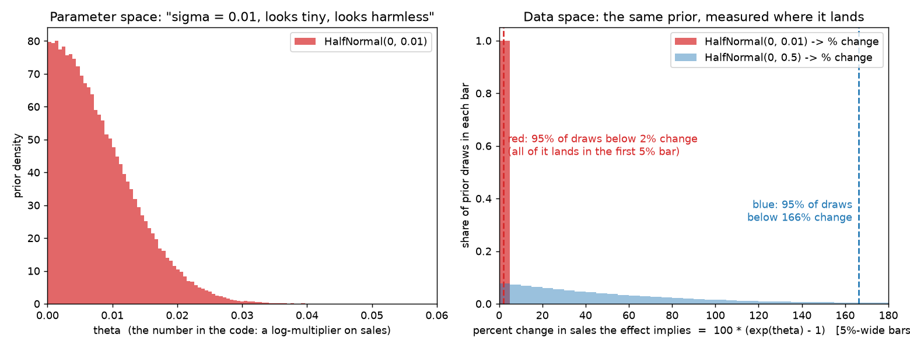

# A prior that looked harmless

One exchange from my Bayesian statistics course, mid-lesson on priors as regularization. The context: MMM means marketing mix model, a regression that attributes sales to advertising channels. It has dozens of parameters, each with a prior.

The figure was drawn by the tutor during the session and pushed to my phone. It is re-rendered here from the tutor's own code. Text is verbatim, typos and voice-typing artifacts included, except that I cut the "what's next" lines at the end of each tutor turn and dropped the name of the project the war story came from.

---

**Tutor**

Figure sent to Telegram. Look at it while you read this.

**The secretly aggressive prior.** This is a real war story. An engineer set priors on a set of effects. The number in the code was small, something like sigma = 0.01. Everyone read it as "small number, gentle prior, harmless". Weeks later someone actually checked what the prior *implied for the data*, and found the prior put almost all its weight on a change of 1 to 2 percent. The model had been told, before seeing data, that these effects basically don't exist. Nobody meant that.

**Why it happens.** The prior sits on a parameter, call it theta. But theta is not sales. Sales is downstream of theta through some transform: an exponent, a softmax, a saturation curve. The prior's *strength* is not the number you typed. It's how much room the prior leaves **where the effect lands**.

**Reading the figure.**

- Left panel: theta, the number in the code. HalfNormal with sigma 0.01. It looks like nothing.
- Right panel: the same draws, pushed through exp and turned into "percent change in sales". Red is that prior. All of it lands in the first bar. 95 percent of draws say "under 2 percent change".
- Blue is a HalfNormal with sigma 0.5. Same shape of prior, fifty times wider. It lets the effect be anything from 0 to a 166 percent lift.

Same code shape. One is "I have no idea how big this is". The other is "this does nothing". The number 0.01 told you neither.

**The fix is a tool you already own from Unit 2:** the prior predictive check. Draw from the priors, push through the whole model, look at the fake data it generates. Measure strength there, in data space, never by squinting at the sigma.

House phrase: **strength lives in data space.**

One-line recap: small sigma is not weak, small sigma is *strong*, and the transform can make it stronger than you think.

**Probe, fresh skin.** A colleague writes `HalfNormal(0.01)` on an effect that feeds through a softmax. They say: "tiny sigma, so it's a weak prior, we're fine."

Two things: is "tiny sigma = weak prior" even right on its own, before the softmax? And what's the one thing you'd do before agreeing with them?

**Me**

I'm a bit confused. You're saying that this prior on the left means that we're saying to the model that sales change is very small, like less than 10%. The extreme is already 10%. You're saying that it's not a weak prior. It's just a wrong prior, right? Tiny sigma doesn't mean weak prior. It means we assume that this won't have that big of an effect, which itself is a strong statement. But I am confused about, or is that just the point of this, what you just said that half norm, like small and big priors, are both strong assumptions? Also separately, just a tangent that you don't have to take too seriously: I'm wondering if these things just get glossed over because there are so many parameters and so many priors to keep track of?

**Tutor**

Not wrong prior, and you've actually got it. Let me restate the core in three sentences, because your second paragraph is correct and the confusion is only in the words "weak" and "strong".

1. **Strong prior = narrow. Weak prior = wide.** That's the only meaning. A strong prior leaves little room, a weak one leaves lots.
2. **Small sigma is a strong prior.** Always. Sigma is the width. The trap is purely psychological: 0.01 *looks* like a small, modest, harmless number, so people read it as "weak". It's the opposite.
3. **Both are assumptions, but not both are strong.** Blue (sigma 0.5) assumes "could be anything up to a big lift". Red (sigma 0.01) assumes "this does nothing". Only red is a strong claim.

So your sentence, "tiny sigma means we assume this won't have a big effect, which is itself a strong statement", is exactly the lesson. "Wrong" is a fair word too: it was strong *and* nobody intended it. That combination is the war story.

One small precision on the figure: red's 95 percent line is at 2 percent change, and the tail dies by about 6 percent. Not 10. You lingered, good.

**Where the transform comes in.** In this example, exp near zero is almost the identity, so 0.01 in theta became about 1 percent in sales. The transform didn't hide anything here, it just made the point visible. With a softmax across many outlets, or a saturation curve, the same 0.01 can become a bigger or smaller claim in data space, and you cannot tell by looking at the number. That's why the check has to happen in data space.

**Your tangent is the right question, not a tangent.** Yes. An MMM has dozens of priors. Nobody reasons about each one by hand, so they get set by habit and copied between projects. That's exactly why prior predictive checks exist as a *routine*, not a special investigation: draw fake data from the priors, plot it against the real data's range, and let the picture flag the ones that are secretly asserting something. pymc-marketing ships this as a built-in plot for that reason.

Recap in one line: sigma tells you width in parameter space; the only honest measure of strength is in data space, and the tool for that is the prior predictive check.
