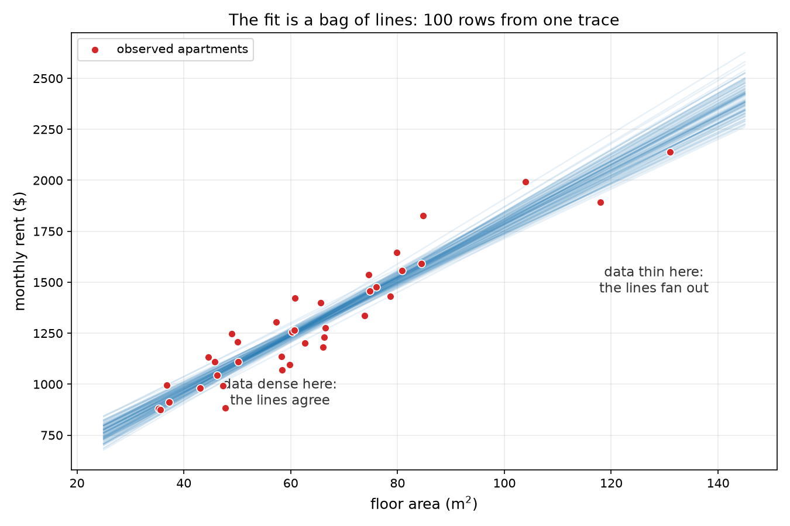
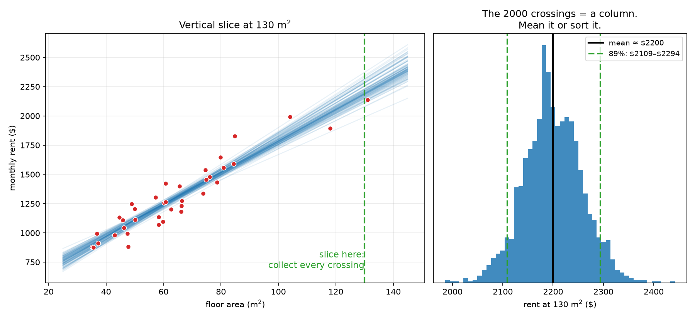

# Where the interval comes from

A stretch of my Bayesian statistics course, the first lesson on linear regression. Earlier in the session the tutor had introduced the model as three "dials" (alpha, beta, sigma) with priors, plus one line of "plumbing" (`mu = alpha + beta * x`), pinned to data. This picks up at the first figure.

The figures were drawn by the tutor during the session (it fit a real PyMC model on 37 fake apartments) and pushed to my phone. They are re-rendered here from the tutor's own code, and the dollar amounts in the text were updated to match the re-rendered fit. Text is otherwise verbatim, typos included, except that I cut a tangent on credible versus confidence intervals and the "what's next" lines.

---

**Tutor**

Check your phone — a figure just landed. That picture is the single most load-bearing image of this unit, so let's stand in front of it for a minute.

What you're looking at: I actually ran the five-line model just now, on 37 apartments. The sampler toured the landscape and left me 2,000 rows in the trace. **Each row is a triple (α, β, σ) — and each (α, β) pair draws one candidate line.** I plotted 100 of them.

So the blue haze is the honest answer to "what's the relationship between area and rent?" — not *a* line, but **a bag of lines**: every line the data hasn't ruled out, drawn on top of each other.

Two things to read off it:

- **Where the red dots are dense** (the 35–85 m² range), the lines are pinned down tight — they practically agree. Lots of data = the likelihood has voted hard = surviving candidates all look alike.
- **Where data is thin** (only 3 apartments above 100 m²), the lines fan out. The model isn't being evasive — it's being honest that several different slopes all explain what little it saw out there.

And here's the connection to a rule you already own. When the boss asks "what rent should we expect for a 120 m² place?" — that's **arithmetic on rows, summarize last**: compute `alpha + beta * 120` on every row of the trace, get 2,000 candidate rents, *then* summarize. Same house rule as ever; a regression prediction is just another column built from the bag.

The classic mistake this picture kills: "the regression line is the answer." The single line you'd normally draw is just the bag's *average*. In the dense region, fine — the bag agrees anyway. In the thin region, the average line is quietly hiding a real disagreement among the survivors.

Read the picture back to me on one question: a client wants a single rent number for a 60 m² apartment, and a single rent number for a 130 m² apartment. Using only what you see in the figure — for which one is a single number a *worse* lie, and what would you hand the client instead?

**Me**

Worst life for 130 m². I don't know how to do the interval but I'd hand them an interval, like this line and that line, like a price range for max and minimum or the percentile. I wonder how you compute percentiles for this actually if any or how you compute averages. Are averages, you just draw a vertical line and get the average of all the pointed hits of all the other lines or do you have to find a single best fit line or single average line?

**Tutor**

You just reinvented the exact mechanic, and I want to confirm it loudly: **yes — you draw a vertical line and collect where every line in the bag crosses it.** No "single best-fit line" is ever needed. Let me wire it to machinery you already own, then put the picture on your phone.

At x = 130, each of the 2,000 trace rows crosses at its own rent: `alpha + beta * 130`, computed per row. That gives you a **2,000-number column** — and now you're back on fully familiar ground, because every question about a column is count-or-sort:

- **Average?** Just `.mean()` of that column.
- **Percentiles / an interval?** *Sort* the column, read off the edges — e.g. chop 5.5% off each end and you have an 89% interval. Numbers out, probability in — your count-vs-sort table from Unit 1, unchanged.

(Side note on your "average line" idea: averaging all the lines and averaging the crossing points give the same *middle* here. But the middle was never the problem — a single line, any single line, has nowhere to carry the **spread**. That's why the client at 130 m² gets an interval and the interval must come from the bag.)

One distinction before the figure lands, because a client will force it on you eventually. There are two different ranges you could hand them:

1. **"Where is the line at 130 m²?"** — the column we just built. Uncertainty about the *average* rent of such apartments.
2. **"What will this actual apartment rent for?"** — a real apartment doesn't sit on the line; it scatters around it by σ. So per row, you also roll the die: take the row's crossing point *and* add Normal(0, that row's σ). Wider range, and honestly so.

Same rule both times — arithmetic on rows, summarize last — question 2 just uses each row's third dial too. Building you the vertical-slice picture now.

On your phone now — left panel is your idea drawn for real (the green dashed slice at 130 m²), right panel is what the slice collects: the 2,000 crossings as a histogram, with the mean and the 89% interval marked.

And the real numbers from the fit, so you see both ranges from a minute ago:

- **Where's the line at 130 m²?** mean ≈ $2,200, 89% interval **$2,109–$2,294**.
- **What will an actual 130 m² apartment rent for?** (each row's crossing + that row's σ die roll): **$2,002–$2,395**. Wider, because real apartments scatter off the line.

Notice the right panel is just… a posterior histogram. Nothing regression-specific survived the slicing: once you have the column, it's Unit 1 all the way down.

**Me**

Ok makes sense. Just confused by this statement

So per row, you also roll the die: take the row's crossing point and add Normal(0, that row's σ).

**Tutor**

Fair — that line was written like code. Let me say it like a story.

Remember: **each row of the trace is one complete candidate universe.** Not just a line — a line *and* a scatter width. Row #212 says: "the line is `alpha₂₁₂ + beta₂₁₂ · x`, and real apartments stray from my line by about σ₂₁₂."

Now the client asks: "what will an actual 130 m² apartment rent for?"

Ask row #212. It answers in two steps, because its own story has two parts:

1. "My line crosses 130 m² at $2,180." ← the crossing point
2. "But I never claimed apartments sit *on* my line — I claimed they scatter around it with width σ₂₁₂. So let me roll my die: Normal(mean = 2180, sd = σ₂₁₂)... I got **$2,310**. That's my simulated apartment."

The phrase you got stuck on — "add Normal(0, σ)" — is just step 2 written as arithmetic: rolling Normal(2180, σ) and rolling Normal(0, σ) *then adding 2180* are the same move. Same die, two ways of writing it.

Do this for all 2,000 rows: each universe rolls its own die once, you collect 2,000 simulated apartments, and that column's spread honestly contains *both* uncertainties — we're not sure where the line is (crossings differ row to row), and even a known line doesn't pin down one apartment (the die roll).

And here's the punchline you already know from Unit 2: **this is the fitted model dreaming data.** It's a posterior predictive draw — same machine as 2.3 — just aimed at one hypothetical apartment instead of at re-dreaming the whole dataset. Nothing new was invented for regression. Again.
